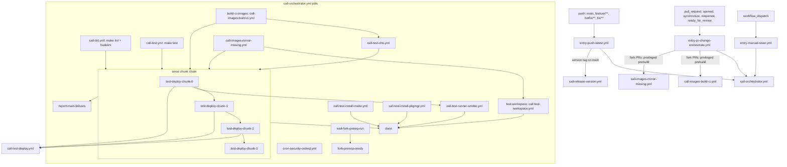
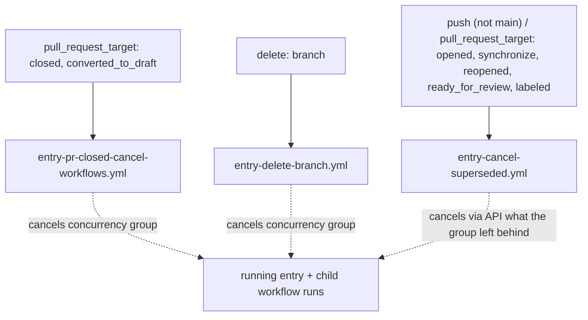
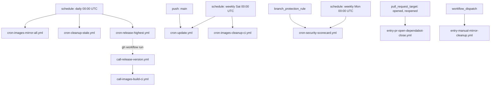

# Workflow Dependency Map

How the workflows under `.github/workflows/` trigger and call each other.
Solid arrows: `workflow_call` (`uses:`) or job `needs`. Dotted arrows:
indirect coupling (CLI dispatch, shared concurrency group). Per-workflow
inputs and descriptions: [workflows.md](../../docs/contributing/tools/github/actions/workflows.md).

## CI pipeline



## Sweeps and chunks

A **sweep** is one orchestrator run. It builds a single ordered list of
`role#variant` rows, assigns each row a deploy mode and a network mode, and
deploys the list in serial **chunk** blocks.

### Why chunks exist

GitHub cancels a job that has sat queued for 24 hours. That clock starts when
the job is queued, not when the run starts, and a `needs:` edge delays queueing
until the dependency completes. A run that queues its whole matrix at once
leaves the tail waiting past the cut, where it dies unrun. Deploying in chunks
chained on `needs:` restarts the clock per chunk.

The chunk size is what makes that safe, and `cli.meta.ci.slots` derives it
rather than pinning it:

```text
waves      = floor(INFINITO_CI_QUEUE_HOURS / the deploy job's timeout-minutes)
chunk size = INFINITO_CI_CONCURRENCY * waves
```

Assuming every job burns its full timeout is deliberately pessimistic — no job
can outlast it — so the estimate can only overshoot the real drain time. With
the current constants that is 4 waves of 20 runners, so 80 rows per chunk, and
the last job of a chunk starts around t=18h, well inside the 24h window.

### How many chunks a sweep spends

The run's 256-job cap is the second ceiling. `slots` counts every non-deploy
job the orchestrator chain spawns, subtracts the worst `entry-*.yml` overhead,
and what remains is `available` — the rows one sweep may deploy across all its
chunks. Rows beyond that roll into the next sweep, which starts reading the
regular line at an offset (`cli.meta.ci.chunks`), so consecutive sweeps walk
the whole list instead of re-testing the same head forever.

GitHub Actions cannot generate a variable number of jobs, so the chunk blocks
are written out in the orchestrator. `INFINITO_CI_MAX_CHUNKS` must equal how
many exist there — `slots` plans a sweep against that key, and a sweep planned
larger than the chain silently drops its tail. Declare one block more than
`available` fills (`ceil(available / chunk size) + 1`): the split receives
every declared block, so after a short priority chunk the regular rows still
fill the rest of the budget. Blocks whose slice comes back empty skip
themselves and cost nothing.

Run `python -m cli.meta.ci.slots --matrix` to see the whole budget.

### Priority

`priority` names the roles that lead. They sort to the head of the list and the
split forces a chunk boundary at the priority/regular seam, so a chunk is
either all priority or all regular — the seam chunk stays short rather than
being topped up. That is what guarantees every priority row is deployed before
the first regular one starts. Priority rows wear a trailing `⭐` in their job
name and never move with the sweep offset.

They are also the rows a run must not sample. A priority row is deployed in
**every combination it can take** — each variant, in each mode its role offers,
and on the modes that carry the network axis once per node network mode the
role can be served in (`clearnet`, `tor`, `multi`) — all within the same sweep.
A 3-variant role offering compose and swarm therefore becomes
3 × 2 × 3 = **18 jobs**, not 3. That is the point of naming a role in
`priority`: it is proven everywhere at once instead of over several sweeps.

An explicit `network` input still wins over the full coverage: `clearnet`,
`tor` and `multi` are operator narrowings. A variant that pins
`services.tor.enabled` to false, or a role without a `tor` bond, only ever runs
on clearnet regardless.

### Selection tokens

An entry in `whitelist` or `priority` is a role name that MAY pin the axes the
row would otherwise be assigned. Two spellings are accepted:

| Form | Example |
|---|---|
| ASCII | `web-app-nextcloud#0,2@swarm+tor%debian/zfs` |
| the job label, pasted back out of the failed run | `🐳🧅🌀🦓网络应用·Nextcloud#0` |

| Separator | Axis | Values |
|---|---|---|
| `#` | variants | comma-separated indices |
| `@` | deploy mode | `compose`, `swarm`, `host` |
| `+` | network mode | `clearnet`, `tor`, `multi` |
| `%` | distro | `arch`, `debian`, `ubuntu`, `fedora`, `centos` |
| `/` | filesystem | `zfs`, `btrfs`, `ext4` |

The network mode is a `+` suffix rather than a `-tor` suffix because a role id
may itself end in `-tor`.

What a token leaves open belongs to the line it stands in: `priority` covers
every remaining combination in one sweep, `whitelist` keeps the rotation and
the row's position in the matrix. A pin the row cannot take aborts the matrix
rather than dropping the row, because a dropped row would report a green run
for a combination that never ran. Such a pin is `@swarm` on a role without its
own stack, `+tor` on a variant that pins `services.tor.enabled` false, `+multi`
on a role with `reachability.single_mode: true`, or any axis that fights the
run's own `mode`, `network`, `distros` or `filesystem` input.

That is also what a retrigger replays: `--failed` reads the glyphs off the failed
job's title and writes them back as a token, so the row comes back in the mode,
network mode and distribution it died on rather than on whatever the rotation
would pick next. The filesystem is deliberately left out. A title states the
kind the matrix *assigned*, which a deploy is allowed to fall back from, so
pinning it would both misstate what the job ran on and turn the kind into a
demand, failing the retrigger on the very condition the fallback absorbs.

### Mode, network, distro and filesystem

A row deploys its node in one network mode, handed to the inventory as
`NETWORK_MODE`. The modes a row can take follow its role
([network_modes.md](../../docs/contributing/design/network_modes.md)): a role
without a `tor` bond, or a variant that pins `services.tor.enabled` false, only
takes `clearnet`; `reachability.modes` drops every mode that needs a network
the role excludes; `reachability.single_mode` drops `multi`; the Tor provider
never takes `clearnet`. The `network` input decides what the axis is allowed
to do at all:

| Value | Effect |
|---|---|
| `auto` | rotates over the modes the row can take; a priority row covers all of them in one sweep |
| `clearnet` | every row runs without Tor, the provider disabled |
| `tor` | the rows that can be served onion-only run in `tor`; the rest are dropped |
| `multi` | the rows that can be served on both networks run in `multi`; the rest are dropped |

A `multi` row runs the role's Playwright suite once, on the clearnet or the
onion URL picked at random, together with the shared cross-network leak spec.

`distros` and `filesystem` narrow the pools the other two axes draw from. Both
default to empty, which means the whole declared set. That is what a sweep
wants, because the rows are spread over the pool rather than all sharing one
value. Narrowing is for chasing a single distribution or a single filesystem.

Whether the assigned filesystem is binding depends on who chose it:

| How the row got its kind | The kind is | A host that cannot serve it |
|---|---|---|
| the rotation, from a pool of two or more (every automatic run) | a preference | falls back inside the pool, and says so in the step summary |
| the rotation, from a pool of exactly one (`filesystem: zfs`) | a demand | fails the row |
| a selection token (`role#0/zfs`) | a demand | fails the row |

A pool of two or more stays a preference because the matrix already narrowed
each row to one kind out of it: falling back to the other kind the run allowed
is inside what the operator asked for, while failing the row is not. A run whose
whole pool is unservable fails rather than leaving the pool.

The narrow case is what a deploy job actually sees, because the matrix hands
every row exactly one kind. Reading that narrowness as a demand would turn every
condition the applying step tolerates into a red row on every deploy: a loop
device it could not claim, a pool another job still holds. The run's own input
decides instead.

A fallback is reported, never silent. The job title and artifact name carry the
kind the matrix *assigned*, while
[docker_dataroot.sh](../../scripts/tests/deploy/utils/filesystem/docker_dataroot.sh)
writes the *effective* filesystem and the reason into the step summary. When a
run has to prove a filesystem-dependent path, read the summary rather than the
title, or name the kind on the run to make it a demand. The snapshot mode of
`svc-bkp-volume-2-local` is the case that matters: it only engages on btrfs and
zfs.

The userland tools are baked into every distro image by
[filesystem.sh](../../scripts/install/filesystem.sh); the kernel side comes from
the host.

For **regular** rows every axis is a deterministic rotation over the row's
position in the global list and the sweep number, never random, so a red job
reproduces by re-running the same sweep:

| Axis | Rotation |
|---|---|
| mode | `(position + sweep) % len(modes the role offers)` |
| network | `(position + sweep // 2) % len(network modes the row can take)` |
| distro | `(position + sweep) % len(distro pool)` |
| filesystem | `(position // len(distro pool) + sweep) % len(filesystem pool)` |

A role offers at most two modes in practice — swarm needs its own stack, host
needs the absence of one — so a row flips between its two modes on consecutive
sweeps. The network turns on `sweep // 2` so it does not flip in lockstep: a
row with two modes and two network modes walks all four combinations over four
sweeps instead of only two. Distro and
filesystem read the position like an odometer, the distro as the low digit, so
consecutive rows walk every pairing of the two pools rather than a diagonal
through it. Turning both on the position directly would cover only as many
pairings as the pools are long whenever they happen to be the same length, and
no sweep would unlock that, because the sweep shifts both by the same amount.
Priority rows skip the
mode/network rotation entirely and take the whole cross-product at once; their
distro and filesystem walk on across those combinations, so one priority role
proves several distributions in one sweep.

Because the same variant can run several times in one sweep, the network mode
is part of what identifies a job: it is in the job label (`🌐`, `🧅` or `🌈`)
and in every artifact name. Two jobs uploading under one artifact name is a
conflict, not an overwrite. The distro and
filesystem glyphs follow it in the label (`🐳🧅🌀🦓`), so a title says which
combination died without opening the job.

### Stopping on failure

`chunk_gate` (default `true`) decides whether the chain stops at its first
failed chunk:

| Value | Behaviour |
|---|---|
| `true` | chunk 0 fails → the remaining chunks are skipped |
| `false` | every chunk deploys and reports; the run still ends red |

`skipped` counts as passed, so an empty chunk never blocks the chain. After
fixing what broke a sweep, `resume_from_chunk` re-enters at that index instead
of re-running the green chunks. Both are inputs on `entry-manual-steer.yml`;
the other entry points take the defaults. A retrigger carries the source run's
`chunk_gate` over unless `infinito administration deploy ci trigger
--chunk-gate false` overrides it; the `i8ciallon` alias is `i8ciall` with that
override, for sweeps that should report every chunk before anyone looks.

## Cancellation



The concurrency group stays the primary mechanism; it reaps within seconds of a
run being created and needs no runner. `entry-cancel-superseded.yml` is the
fallback for the case where it does not, and carries no group of its own,
because the run holding a group cannot be the run that frees it.

A workflow the entries call declares no `concurrency` of its own: its jobs then
belong to the entry's group, and the entry's `cancel-in-progress` reaches them.
`call-images-build-ci.yml` and `call-images-mirror-missing.yml` still declare
one, so a run whose only live job is theirs stays outside the entry's group and
waits for the fallback.

## Scheduled and standalone



Also manually dispatchable: `cron-images-mirror-all.yml`, `cron-images-cleanup-ci.yml`,
`cron-cleanup-stale.yml`, `cron-update.yml`, `cron-release-highest.yml`, `call-release-version.yml`,
`call-lint.yml`, `call-test.yml`, `call-test-dns.yml`,
`call-test-workspace.yml`, `call-test-runner-smoke.yml`.
