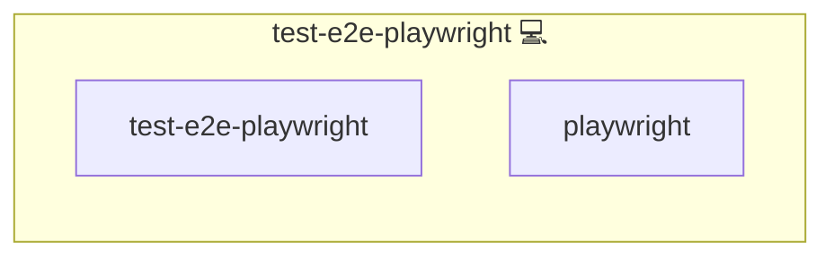

# Test: E2E Playwright Runner

## Description

This Ansible role provides a generic, reusable Playwright end-to-end (E2E) test runner
for the Infinito.Nexus ecosystem.

It automatically discovers roles that ship a Playwright test project under:

- `roles/<application_id>/templates/playwright.env.j2`
- `roles/<application_id>/files/playwright/playwright.spec.js`

A role is considered Playwright-enabled if it provides:

- `roles/<application_id>/templates/playwright.env.j2`

The role then stages the Playwright project to a local staging directory, renders a `.env`
file from `templates/playwright.env.j2`, optionally waits until the application is reachable, and executes
Playwright inside a Docker image derived from the central Playwright package version.

## Overview

This role:

- Discovers Playwright-enabled roles by scanning `roles/*/templates/playwright.env.j2`
- Supports allow-/deny-lists via `test_e2e_playwright_only_roles` and `test_e2e_playwright_skip_roles`
- Stages each Playwright project into `TEST_E2E_PLAYWRIGHT_STAGE_BASE_DIR/<application_id>`
- Renders the central `package.json` template into each staged project and injects the central `playwright.config.js`
- Copies every role-specific `files/playwright/*.js` (the `playwright.spec.js` aggregator plus its `test-*.js` scenario modules) into the staged `tests/` directory, and stages `files/playwright/fixtures/` (binary assets such as sample images/videos) alongside them
- Renders `.env` from `templates/playwright.env.j2` using Ansible variables (`application_id`, `domains`, `users`, `applications`)
- Optionally waits until the application responds with HTTP `200` or `302`
- Injects CA trust automatically for `TLS_MODE=self_signed` (via `CA_TRUST.*`), so Playwright accepts self-signed cert chains
- Runs Playwright in Docker with stable browser settings (`--ipc=host`, `--shm-size=1g`)
- Runs the suite once per role on one network it is served on (`lookup('network_siblings', ...)`), picked at random when there are several and kept for the flake retry, with the `.env` rendered for that network's vhost
- Stores per-role reports/artifacts under `TEST_E2E_PLAYWRIGHT_REPORTS_BASE_DIR/<application_id>`, or under `<application_id>+<network>` when the pick is not the canonical network

## Cosmos

The diagram places Test: E2E Playwright Runner in the Infinito.Nexus cosmos: the components it deploys (capabilities), the central services it consumes (dependencies), and its outward reach (federation and bridged external networks).



Solid `1:1` edges are fixed relationships; dashed `0..1` edges are conditional (enabled only in matching deployments); red `0..0` edges are turned off in this role. Node markers show the role's deploy modes (💻 host, 🐳 compose, 🐝 swarm); ❌ marks a service that is explicitly turned off, and ⚙️ an Ansible role dependency declared in `meta/main.yml`.

## Features

- **Automated provisioning:** Configured by Ansible without manual steps.

## Purpose

The purpose of this role is to provide a central E2E test primitive that can be executed
at the end of a deployment (for example, as a post task), without hardcoding tests in the
runner itself.

Each application role stays responsible for its own Playwright tests and configuration.
This role only provides the execution framework.

## Role contract (what application roles must provide)

A Playwright-enabled role must provide:

```
roles/<application_id>/
    templates/playwright.env.j2
    files/playwright/playwright.spec.js
```

For the file-level contract, use [Contributing `playwright.env.j2`](../../docs/agents/files/role/playwright.env.j2.md) and [Contributing `playwright.spec.js`](../../docs/contributing/artefact/files/role/playwright.specs.js.md).

`package.json` and `playwright.config.js` are provided centrally by this role:

- `roles/test-e2e-playwright/templates/package.json.j2` (rendered per-deploy; pins `@playwright/test` from `meta/services.yml.playwright.version`)
- `roles/test-e2e-playwright/files/playwright.config.js` (copied as-is)

## Included files

This role ships central Playwright defaults:

- `templates/package.json.j2`: `@playwright/test` version derived from `meta/services.yml.playwright.version`
- `files/playwright.config.js`: shared Playwright configuration
- `files/network-leak.spec.js`: guest persona and cross-network leak check, staged next to every role spec and skipped unless `PLAYWRIGHT_NETWORK_LEAK=true`, which the runner sets when the role is served on more than one network

All three are used as central defaults for every app role.

## Variables

### Staging & reports

- `TEST_E2E_PLAYWRIGHT_STAGE_BASE_DIR` (default: `/tmp/test-e2e-playwright`)
- `TEST_E2E_PLAYWRIGHT_REPORTS_BASE_DIR` (default: `/var/lib/infinito/logs/test-e2e-playwright`)

### Playwright runtime

- `TEST_E2E_PLAYWRIGHT_IMAGE` (resolved in `vars/main.yml` from `meta/services.yml.playwright.image` + `.version` via `lookup('config', 'test-e2e-playwright', 'services.playwright.image|version')`)
- `TEST_E2E_PLAYWRIGHT_IMAGE_DISTRO` (default: `noble`)
- `TEST_E2E_PLAYWRIGHT_COMMAND` (default: `npm install --no-fund --no-audit && npx playwright test`)

### Discovery filters

- `test_e2e_playwright_only_roles` (default: `lookup('deployment').running`, every role the round deploys, dependencies included)
- `test_e2e_playwright_skip_roles` (default: `[]`)

## Design notes

- The runner is intentionally test-agnostic at runtime: it executes only tests provided by application roles.
- `playwright.version` in `meta/services.yml` is the single source of truth for the default Playwright version; the central `templates/package.json.j2` pins it via the `image_version` filter.
- `templates/playwright.env.j2` acts as the stable marker for discovery and as the source of environment configuration.
- Playwright is executed in Docker for reproducibility and consistent browser dependencies.
- In `TLS_MODE=self_signed`, the role requires `CA_TRUST.cert_host`, `CA_TRUST.wrapper_host`, and `CA_TRUST.trust_name` and fails early if cert/wrapper files are missing.

## How to use

1. Add the two app-specific files:
   - `roles/<application_id>/templates/playwright.env.j2`
   - `roles/<application_id>/files/playwright/playwright.spec.js`
   Follow [Contributing `playwright.env.j2`](../../docs/agents/files/role/playwright.env.j2.md) and [Contributing `playwright.spec.js`](../../docs/contributing/artefact/files/role/playwright.specs.js.md) while creating them.
2. Deploy a round that includes your app (e.g. `make compose-deploy apps=<application_id>`); its specs run with those of every other role the round deploys.
3. Keep `package.json` and `playwright.config.js` centralized in `roles/test-e2e-playwright/` (`templates/package.json.j2` and `files/playwright.config.js`).

Example override for running only one spec:

`-e TEST_E2E_PLAYWRIGHT_COMMAND='npm install --no-fund --no-audit && npx playwright test tests/login.spec.js'`

## Recording

For interactive Playwright recording, use the external repository:

[playwright-recorder](https://github.com/kevinveenbirkenbach/playwright-recorder)

This role no longer ships its own local recording wrapper.

## Credits

Implemented by **[Kevin Veen-Birkenbach](https://www.veen.world)**.
Part of the [Infinito.Nexus Project](https://s.infinito.nexus/code) and maintained by [Kevin Veen-Birkenbach](https://www.veen.world).
Licensed under the [Infinito.Nexus Community License (Non-Commercial)](https://s.infinito.nexus/license).
