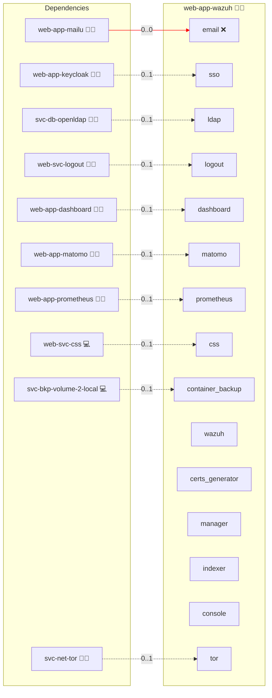
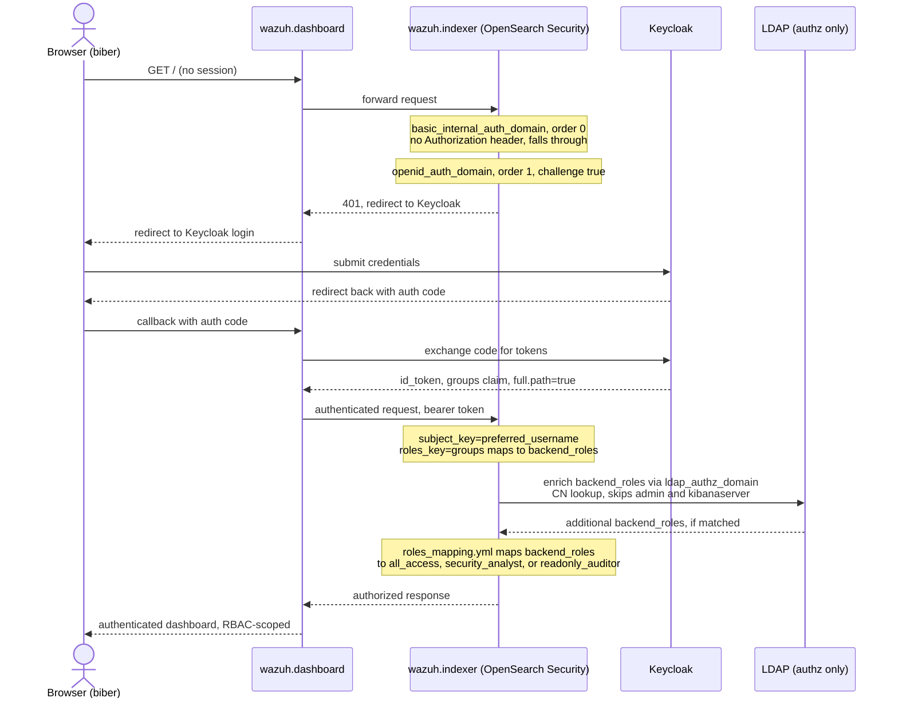

# Wazuh

## Description

[Wazuh](https://wazuh.com/) is an open-source SIEM and XDR platform providing security monitoring, log analysis, intrusion and vulnerability detection, and compliance support.

## Overview

This role deploys the single-node Wazuh stack (`wazuh.manager`, `wazuh.indexer`, `wazuh.dashboard`) with Docker Compose or Docker Swarm.
A one-shot `wazuh-certs-generator` job creates the internal TLS material before the manager and the indexer start.
The indexer is the stack's own datastore and holds the OpenSearch security configuration, so the role needs no shared database.
Agent enrollment is not part of this role: the agent ports are declared in [services.yml](./meta/services.yml) but not published.

## Cosmos

The diagram places Wazuh in the Infinito.Nexus cosmos: the components it deploys (capabilities), the central services it consumes (dependencies), and its outward reach (federation and bridged external networks).



Solid `1:1` edges are fixed relationships; dashed `0..1` edges are conditional (enabled only in matching deployments); red `0..0` edges are turned off in this role. Node markers show the role's deploy modes (💻 host, 🐳 compose, 🐝 swarm); ❌ marks a service that is explicitly turned off, and ⚙️ an Ansible role dependency declared in `meta/main.yml`.

## Features

- **Single-node Wazuh stack:** Manager, indexer, and dashboard at the versions pinned in [services.yml](./meta/services.yml).
- **Native OIDC login:** The dashboard signs users in against Keycloak's discovery endpoint, without an oauth2-proxy sidecar.
- **LDAP authorization:** LDAP group membership adds `backend_roles` to an already authenticated user and is never used to verify a password.
- **Three-tier RBAC:** Administrator, Security Analyst, and Read-only Auditor, declared in [rbac.yml](./meta/rbac.yml) and mapped onto OpenSearch security roles.
- **Generated credentials:** Every service account password and the manager cluster key come from [secrets.yml](./meta/secrets.yml).

## Quick Setup

### Development

Clone, set up the workstation, and deploy Wazuh onto the local stack:

```bash
git clone https://github.com/infinito-nexus/core.git
cd core
make onboard
make compose-deploy mode=reinstall apps=web-app-wazuh full_cycle=false
```

### Production

Run the published image to provision the inventory and deploy Wazuh to a managed server (the mounted volume persists the inventory):

```bash
APP=web-app-wazuh
HOST=<your-server>
DOMAIN=<your-domain>
TLS_MODE=self_signed
SSH_PUBLIC_KEY="<your-ssh-public-key>"

docker run --rm -it \
  -v "$PWD/inventories:/etc/infinito.nexus/inventories" \
  -e APP="$APP" -e HOST="$HOST" -e DOMAIN="$DOMAIN" -e TLS_MODE="$TLS_MODE" -e SSH_PUBLIC_KEY="$SSH_PUBLIC_KEY" \
  ghcr.io/infinito-nexus/core/debian bash -c '
    INVENTORY=/etc/infinito.nexus/inventories/production
    infinito administration inventory provision "$INVENTORY" \
      --inventory-file "$INVENTORY/devices.yml" \
      --host "$HOST" \
      --include "$APP" \
      --vars "{\"TLS_MODE\": \"$TLS_MODE\", \"DOMAIN_PRIMARY\": \"$DOMAIN\", \"users\": {\"administrator\": {\"authorized_keys\": [\"$SSH_PUBLIC_KEY\"]}}}" &&
    infinito administration deploy dedicated "$INVENTORY/devices.yml" \
      --password-file "$INVENTORY/.password" \
      --diff -vv'
```

## Auth flow



The internal `admin` and `kibanaserver` service accounts authenticate with HTTP basic auth against `internal_users.yml` and bypass OIDC and LDAP.
With `sso` disabled, these two accounts are the only way to sign in.

## RBAC

| Role | OpenSearch role | `backend_roles` (OIDC) | `backend_roles` (LDAP) |
|---|---|---|---|
| Administrator | `all_access` | `/roles/web-app-wazuh/administrator` | `web-app-wazuh-administrator` |
| Security Analyst | `security_analyst` | `/roles/web-app-wazuh/security-analyst` | `web-app-wazuh-security-analyst` |
| Read-only Auditor | `readonly_auditor`, `kibana_read_only` | `/roles/web-app-wazuh/readonly-auditor` | `web-app-wazuh-readonly-auditor` |

- Grant a role by adding the user to the matching Keycloak group or LDAP group.
- A group change applies on the user's next request, because the indexer's auth cache is disabled.
- Only Administrators reach the OpenSearch Dashboards Security app.
- Every role lands on `/app/home` after login.

## Developer Notes

Variant matrix: [variants.yml](./meta/variants.yml). Service flags and image pins: [services.yml](./meta/services.yml). Credentials: [secrets.yml](./meta/secrets.yml). RBAC roles: [rbac.yml](./meta/rbac.yml).

## Further Resources

- [Wazuh Official Website](https://wazuh.com/)
- [Wazuh Documentation](https://documentation.wazuh.com/current/)
- [wazuh-docker GitHub](https://github.com/wazuh/wazuh-docker)

## Credits

Implemented by **[Prageeth Panicker](https://github.com/pragepani)**.
Part of the [Infinito.Nexus Project](https://s.infinito.nexus/code) and maintained by [Kevin Veen-Birkenbach](https://www.veen.world).
Licensed under the [Infinito.Nexus Community License (Non-Commercial)](https://s.infinito.nexus/license).
